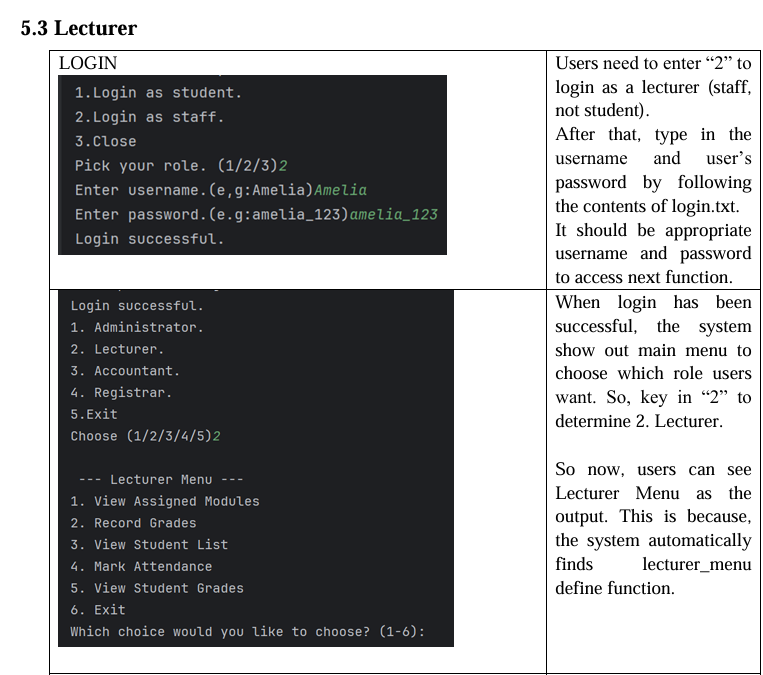
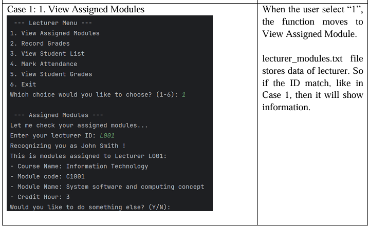
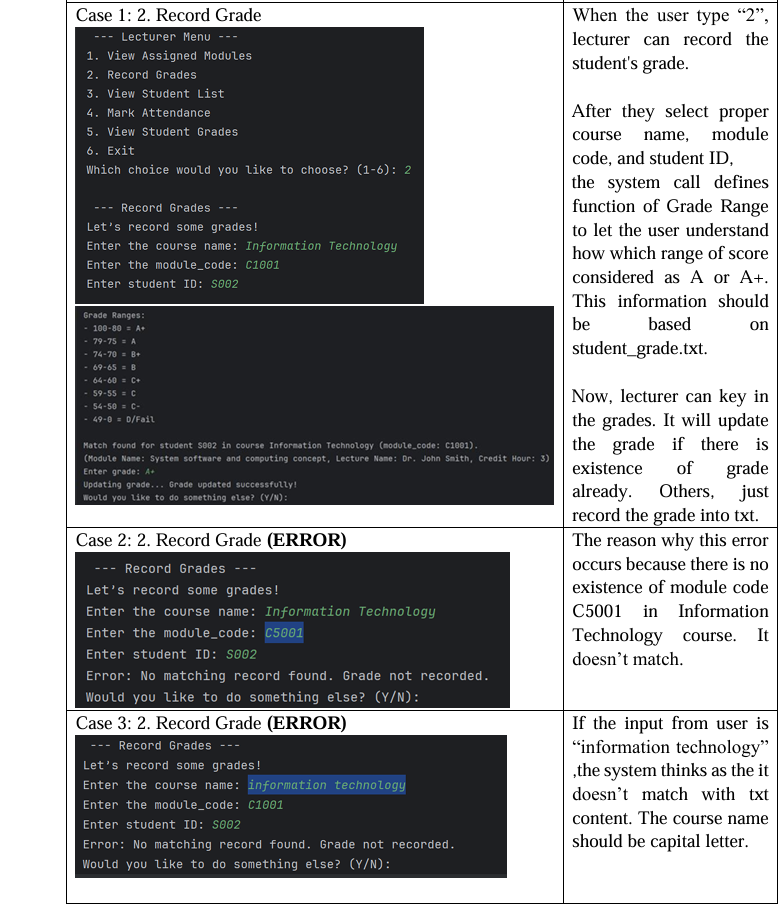
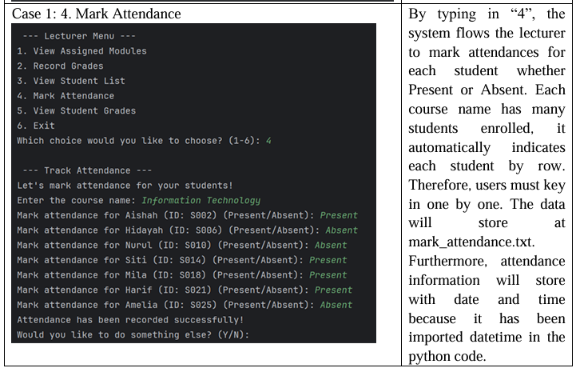

# University Management System
（大学管理システム）
This is a Python-based university management system developed as part of a coursework project.

---

## Overview（概要）

This system allows different types of users (such as lecturers) to manage university-related data including modules, student grades, and attendance records.

本システムは、講師などのユーザーが科目情報、成績、出席情報を管理できるPythonベースの大学管理システムです。

---

## Features

- Role-based login system (Student / Lecturer / Admin)
- View assigned modules (file handling)
- Record student grades (with validation and update)
- Mark student attendance (Present / Absent input)
- Data stored using text files

---

## My Contribution（担当部分）

- Implemented lecturer menu system  
- Developed grade recording logic with validation  
- Designed attendance tracking system  
- Implemented file-based data handling  

講師機能（Lecturer部分）の設計・実装を担当しました。

---

## Lecturer Functions (Screenshots)

### Lecturer Menu


### View Assigned Modules


### Record Grades


### Mark Attendance


---

## Technologies Used

- Python
- File Handling (.txt)
- CLI (Command Line Interface)

---

## How to Run

1. Download all files  
2. Ensure all `.txt` files are in the same directory  
3. Run the following command:

```bash
python "Python Assignment University.py"
